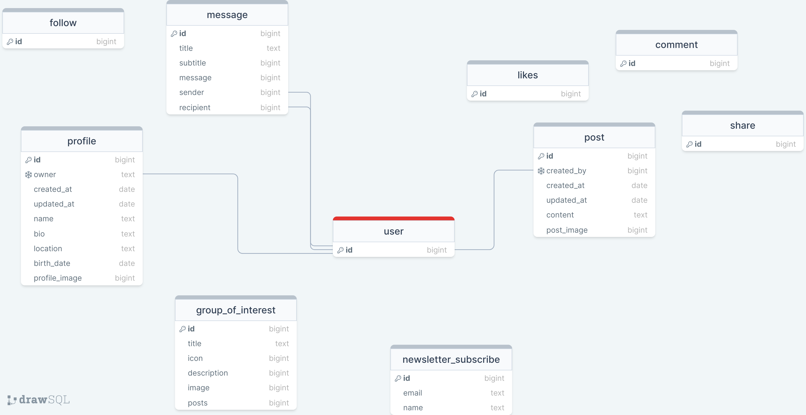

# Django Rest Framework API

# for Mom Network project

## Live: https://mom-network-backend.herokuapp.com/

### The Database

### Initial Terminal commands

- Install Django: pip3 install django

- Create Project: django-admin startproject api_for_mom .

- Install Cloudinary Storage: pip install django-cloudinary-storage

- Install Pillow (Image Processing): pip install Pillow

- Create env.py file and store the Cloudinary url value

- In settings.py, add Cloudinary to installed apps and create storage

### Other Terminal commands and repeated App creation process

1. Create the App: python manage.py startapp _my_app_name_
    -  add it to installed apps in settings.py.
2. Make a Model:

    - from django.db import models
    - from django.contrib.auth.models import User
    - class _my_Model_name_(models.Model):
    - all the fields, methods and the Meta class
    - migrate into your database: in the Terminal 
        - python manage.py makemigrations
        - python manage.py migrate

3. Create a Serializer for this Model: create the serializers.py file, inside that file:

    - from rest_framework import serializers,
    - .models import _my_model_name_

4. Make generic Viewset, in views.py:

    - from rest_framework.views import APIView
    - from .models import _my_Model_name_
    - from .serializers import _my_Serializer_name_
    - other imports

5. Create the Route(s) in urls.py

### Deployment

The Deployment of the Mom Network API has been completed with the following steps:

1. Create Heroku App
2. Create a new external ElephantSQL database
3. Connect ElephantSQL to Heroku
4. Install and configure extra libraries
    - Install dj_database_url
    - Install gunicorn
    - Create Procfile for Heroku: Add code to let Heroku know how to run the project
    - Set the ALLOWED_HOSTS
    - Install CORS

5. Set remaining environment variables
    - in settings.py
    - Heroku config vars

6. Connect the project’s GitHub repo to Heroku

### Sources & Credits

Build a REST API with Django REST Framework: https://medium.com/swlh/build-your-first-rest-api-with-django-rest-framework-e394e39a482c

### Tools

Draw SQL Graph: https://drawsql.app/

### Acknowledgments

Richard Wells - the course mentor for friendly guidance, help with refactoring some code and numerous project feedback sessions
